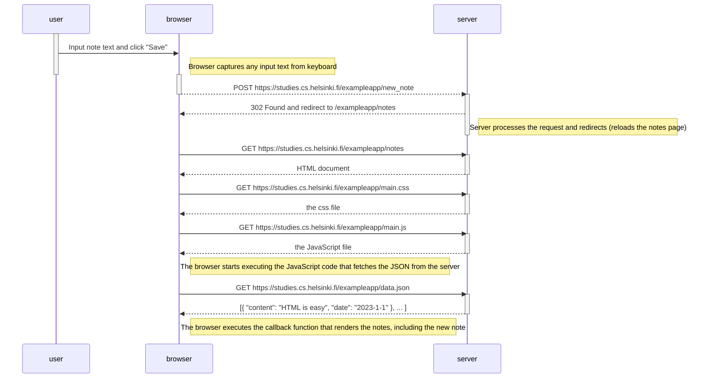

```mermaid
sequenceDiagram
    participant user
    participant browser
    participant server
    
    activate user
    user->>browser: Input note text and click "Save"
    Note right of browser: Browser captures any input text from keyboard
    deactivate user

    activate browser
    browser-->>server: POST https://studies.cs.helsinki.fi/exampleapp/new_note
    deactivate browser

    activate server
    server-->>browser: 302 Found and redirect to /exampleapp/notes
    Note right of server: Server processes the request and redirects (reloads the notes page)
    deactivate server

    browser->>server: GET https://studies.cs.helsinki.fi/exampleapp/notes
    activate server
    server-->>browser: HTML document
    deactivate server

    browser->>server: GET https://studies.cs.helsinki.fi/exampleapp/main.css
    activate server
    server-->>browser: the css file
    deactivate server

    browser->>server: GET https://studies.cs.helsinki.fi/exampleapp/main.js
    activate server
    server-->>browser: the JavaScript file
    deactivate server

    Note right of browser: The browser starts executing the JavaScript code that fetches the JSON from the server

    browser->>server: GET https://studies.cs.helsinki.fi/exampleapp/data.json
    activate server
    server-->>browser: [{ "content": "HTML is easy", "date": "2023-1-1" }, ... ]
    deactivate server

    Note right of browser: The browser executes the callback function that renders the notes, including the new note

```
