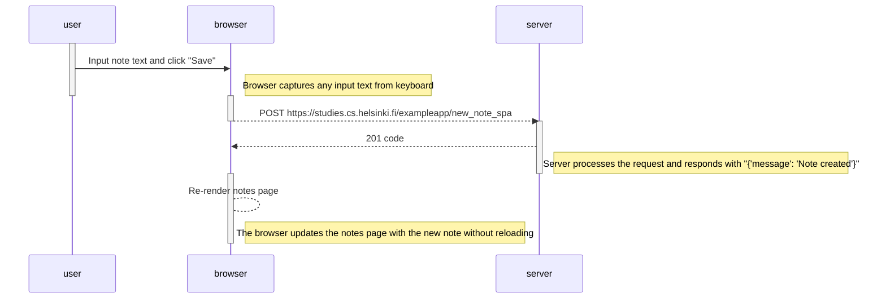

```mermaid
sequenceDiagram
    participant user
    participant browser
    participant server
    
    activate user
    user->>browser: Input note text and click "Save"
    Note right of browser: Browser captures any input text from keyboard
    deactivate user

    activate browser
    browser-->>server: POST https://studies.cs.helsinki.fi/exampleapp/new_note_spa
    deactivate browser

    activate server
    server-->>browser: 201 code 
    Note right of server: Server processes the request and responds with "{'message': 'Note created'}"
    deactivate server

    activate browser
    browser-->browser: Re-render notes page
    Note right of browser: The browser updates the notes page with the new note without reloading
    deactivate browser


```
